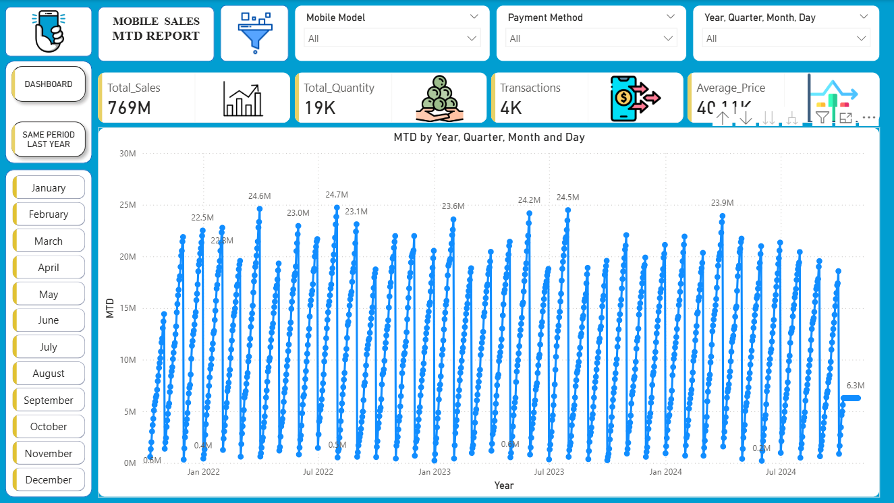
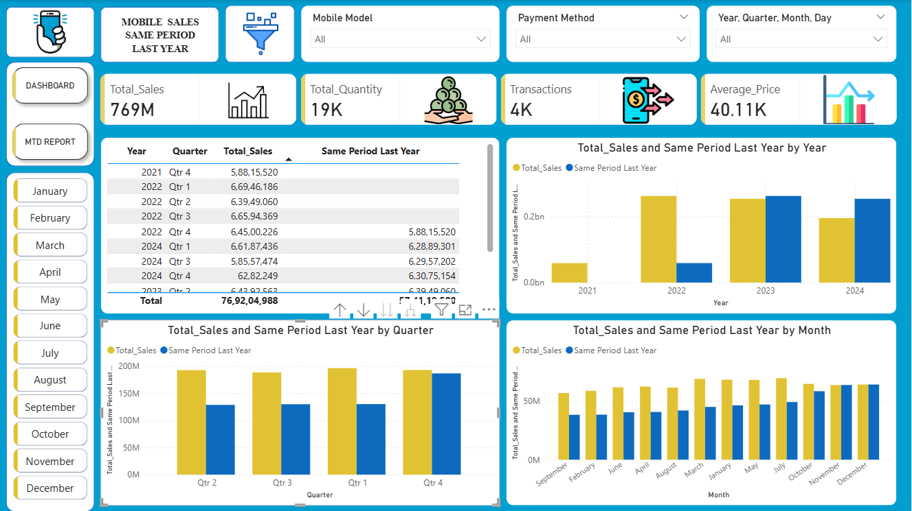

# 📱 Mobile Sales Dashboard — Power BI

An interactive 3-page Power BI dashboard analyzing mobile phone sales across Indian cities, brands, and time periods.

---

## 📊 Dashboard Pages

### 1. Main Dashboard
- KPI cards: Total Sales (769M), Total Quantity (19K), Transactions (4K), Avg Price (40.11K)
- Geographic map showing Total Sales by City across India
- Line chart: Total Quantity by Month
- Bar chart: Total Sales by Mobile Model (iPhone SE, OnePlus Nord, Galaxy Note)
- Pie chart: Transactions by Payment Method (UPI, Debit Card, Credit Card, Cash)
- Bar chart: Customer Ratings by Rating Status
- Bar chart: Total Sales by Day Name

### 2. MTD Report (Month-To-Date)
- MTD sales trend across Year, Quarter, Month, and Day
- Time-series view from 2021 to 2024
- Drill-down capability by time hierarchy

### 3. Same Period Last Year
- YoY comparison table by Year and Quarter
- Clustered bar charts: Total Sales vs Same Period Last Year
- Breakdowns by Year, Quarter, and Month

---

## 🔍 Key Insights
- **Apple** leads with ₹16.16Cr in sales across 783 transactions
- **iPhone SE** is the top-selling model at ₹60M
- Sales are nearly evenly split across all 4 payment methods (~25% each)
- **Monday and Friday** are the highest-performing sales days
- Consistent YoY growth visible from 2021 to 2024

---

## 🛠 Tools & Features Used
- **Tool:** Microsoft Power BI Desktop
- **DAX Functions:** MTD, SAMEPERIODLASTYEAR (Time Intelligence)
- **Visuals:** Map, Line Chart, Bar Chart, Pie Chart, KPI Cards, Matrix Table
- **Filters/Slicers:** Mobile Model, Payment Method, Brand, Month, Year

---

## 📁 Files
| File | Description |
|------|-------------|
| `MOBILE_SALES_DASHBOARD.png` | Main dashboard screenshot |
| `MOBILE_SALES_MTD_REPORT.png` | MTD Report page screenshot |
| `MOBILE_SALES_SAME_PERIOD_LAST_YEAR_REPORT.png` | YoY comparison page screenshot |
| `Mobile_Sales_Dashboard.pbix` | Power BI project file |

---

## 📸 Screenshots

### Main Dashboard

### MTD Report

### Same Period Last Year

---

## 👤 Author
Avnish Choudhary 
Aspiring Data Analyst | Power BI | Excel | SQL  

